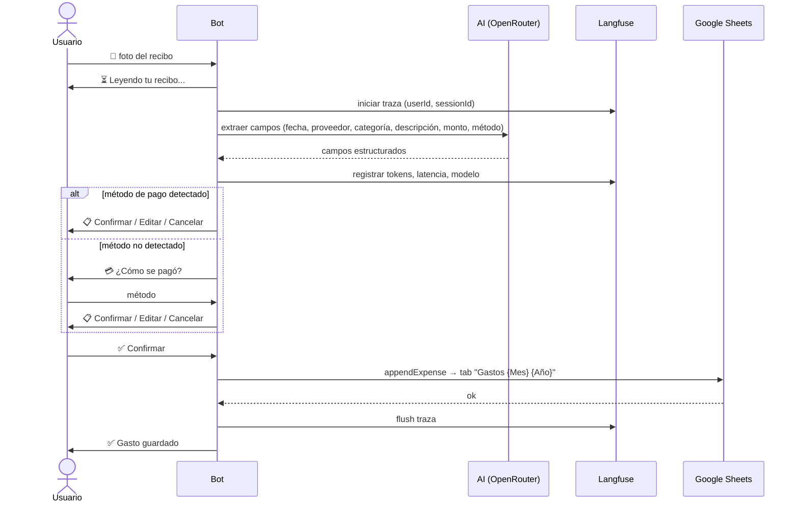

# Expense Bot

AI-powered expense tracker for Telegram and WhatsApp. Logs expenses from receipts, voice notes, or free-text directly into a Google Sheets workbook, one tab per month.

## Features

- **Receipt scanning** — photo → AI extraction (date, provider, category, description, amount, method); method step skipped if detected on the receipt
- **Voice notes** — audio → transcription → structured expense; method step skipped if mentioned
- **Free-text entry** — conversational AI agent parses natural-language messages ("200 mil de transporte a Nequi")
- **Manual entry** — guided step-by-step flow: amount → provider → category → description → method → confirmation
- **Edit before saving** — modify any field (amount, provider, category, description, method) from the confirmation card
- **NLP queries** — "¿cuánto gasté en sueldos este mes?" answered by a tool-calling agent
- **Monthly summary** — per-category breakdown with totals
- **Auto tab creation** — if the tab for the current month doesn't exist it is created automatically with the correct headers; expenses with a past or future date are routed to their correct month's tab
- **Multi-channel** — same logic on Telegram and WhatsApp (Twilio)
- **Session persistence** — Redis-backed state survives deploys (2 h TTL)

## Tech Stack

| Layer | Technology |
|---|---|
| Runtime | Node.js 20 (Alpine) |
| Framework | NestJS 11 + TypeScript 5.7 |
| Package manager | pnpm |
| AI / LLM | Vercel AI SDK → OpenRouter (multi-model fallback) |
| Messaging | Telegram (`node-telegram-bot-api`), WhatsApp (Twilio) |
| Session state | Upstash Redis |
| Storage | Google Sheets API |
| Receipt images | Google Drive API (optional) |
| Observability | Langfuse (optional) |
| Audio processing | ffmpeg (OGG → MP3) |

## Project Structure

```
src/
├── ai/
│   ├── agents/          # Tool-calling agents (expenses Q&A)
│   ├── connectors/      # Vercel AI SDK → OpenRouter adapter
│   ├── langfuse/        # Optional AI observability
│   ├── prompts/         # Prompt templates
│   └── schemas/         # Zod schemas for structured AI output
├── conversation/        # State machine + Redis session management
├── google/              # Sheets + Drive service clients
├── i18n/                # Message catalog (en.json)
├── shared/              # MessagingPort interface, expense types, categories
├── telegram/
│   ├── handlers/        # menu, expense, receipt, query, insights
│   └── ...              # adapter, dispatcher, webhook controller
└── whatsapp/            # adapter, dispatcher, webhook controller, templates
```

## Environment Variables

Copy `.env.example` and fill in your values:

```bash
cp .env.example .env
```

| Variable | Required | Description |
|---|---|---|
| `TELEGRAM_BOT_TOKEN` | ✅ | From @BotFather |
| `TELEGRAM_TRANSPORT` | ✅ | `polling` (dev) or `webhook` (prod) |
| `TELEGRAM_WEBHOOK_URL` | webhook only | e.g. `https://expense-bot.onrender.com/telegram/webhook` |
| `OPENROUTER_API_KEY` | ✅ | [openrouter.ai](https://openrouter.ai) — free tier works |
| `GOOGLE_APPLICATION_CREDENTIALS` | ✅ (local) | Path to service account JSON key file |
| `GOOGLE_CLIENT_EMAIL` | ✅ (prod) | Service account email (used when no key file) |
| `GOOGLE_PRIVATE_KEY` | ✅ (prod) | Service account private key (keep `\n` escapes) |
| `GOOGLE_SHEET_ID` | ✅ | Target spreadsheet ID |
| `GOOGLE_DRIVE_FOLDER_ID` | ❌ | Folder for receipt image uploads |
| `UPSTASH_REDIS_REST_URL` | ✅ | [upstash.com](https://upstash.com) serverless Redis |
| `UPSTASH_REDIS_REST_TOKEN` | ✅ | Upstash REST token |
| `TWILIO_ACCOUNT_SID` | ❌ | WhatsApp channel only |
| `TWILIO_AUTH_TOKEN` | ❌ | WhatsApp channel only |
| `TWILIO_WHATSAPP_NUMBER` | ❌ | Default: `whatsapp:+14155238886` |
| `WHATSAPP_WEBHOOK_URL` | ❌ | For Twilio signature validation |
| `LANGFUSE_SECRET_KEY` | ❌ | AI observability |
| `LANGFUSE_PUBLIC_KEY` | ❌ | AI observability |
| `LANGFUSE_BASEURL` | ❌ | Default: `https://cloud.langfuse.com` |
| `PORT` | ❌ | Default: `3000` |

## Local Development

```bash
pnpm install

# Telegram polling mode (no public URL needed)
TELEGRAM_TRANSPORT=polling pnpm start:dev
```

## Scripts

```bash
pnpm build              # Compile TypeScript → dist/
pnpm start              # Run compiled build
pnpm start:dev          # Watch mode
pnpm test               # Unit tests
pnpm test:cov           # Coverage report
pnpm lint               # ESLint + autofix
pnpm format             # Prettier
pnpm telegram:webhook:info  # Inspect registered webhook
```

## Docker

```bash
docker build -t expense-bot .
docker run --env-file .env -p 3000:3000 expense-bot
```

The Dockerfile uses a multi-stage build: compiles in Node 20 Alpine, copies `dist/` + production deps + `ffmpeg` to the runtime image (~120 MB).

## Deployment (Render)

A `render.yaml` is included. Steps:

1. Push to GitHub and connect the repo in [Render](https://render.com)
2. Set all required environment variables in the Render dashboard
3. Set `TELEGRAM_TRANSPORT=webhook` and `TELEGRAM_WEBHOOK_URL=https://<your-render-url>/telegram/webhook`
4. Deploy — the bot registers the Telegram webhook automatically on startup
5. *(WhatsApp)* Point Twilio's webhook to `https://<your-render-url>/whatsapp/webhook`

## Google Sheets Setup

1. Create a Google Cloud project and enable the **Sheets API** (and **Drive API** if using receipt uploads)
2. Create a service account and download the JSON key
3. Share your spreadsheet with the service account email (Editor)
4. Set `GOOGLE_SHEET_ID` to the spreadsheet ID (from the URL)

The bot manages monthly tabs automatically. Each tab is named **"Gastos {Mes} {Año}"** (e.g. `Gastos Abril 2026`). If the tab for the current month doesn't exist when an expense is saved, it is created with the header row. Expenses with a past or future date are written to their correct month's tab.

Sheet columns: `Fecha · Proveedor · Categoria · Description · Valor · Metodo · Por`

## AI Models

All AI calls go through OpenRouter with an automatic fallback chain:

| Task | Primary | Fallback |
|---|---|---|
| Receipt (image) | `google/gemini-2.0-flash-001` | `openai/gpt-4o-mini` |
| Voice transcription | `openai/gpt-audio-mini` | `google/gemini-2.5-flash-lite` |
| Text extraction | `google/gemini-2.0-flash-001` | `openai/gpt-4o-mini` |
| Conversational agent | `openai/gpt-4o-mini` | — |
| Q&A / insights agent | `openai/gpt-4o-mini` | — |

All structured outputs are validated with Zod schemas — no regex parsing.

## Expense Categories

`Compras · Pagos · Sueldos · Transporte`

## Payment Methods

`Efectivo · Transferencia · Tarjeta · Nequi / Daviplata · Otro`

## Registration Flow



## Architecture Notes

- **`MessagingPort` interface** — all handlers are platform-agnostic; `TelegramAdapter` and `WhatsAppAdapter` translate to platform-specific APIs
- **State machine** — 11 conversation states managed by `ConversationService` (Redis-backed, in-memory hot cache)
- **Conversational agent** — `ConversationAgent` handles free-text input with tool-calling (save, edit, query) for up to 6 reasoning steps
- **Insights agent** — `ExpensesQueryAgent` answers natural-language expense questions with up to 6 reasoning steps
- **OpenTelemetry tracing** — wraps every AI call with Langfuse traces; silently disabled when keys are absent
